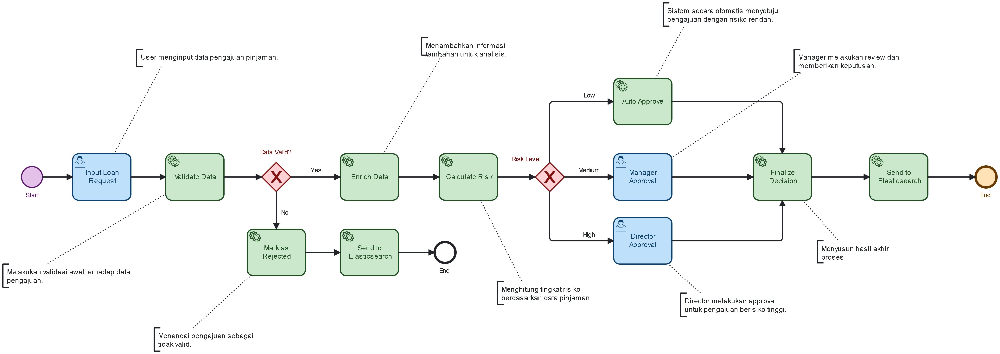
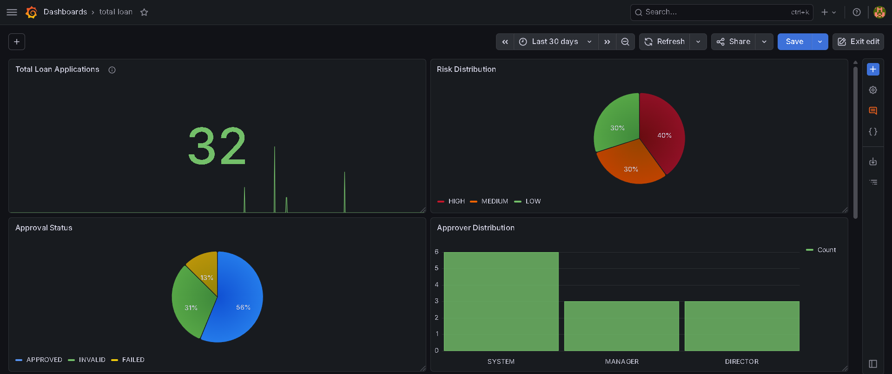
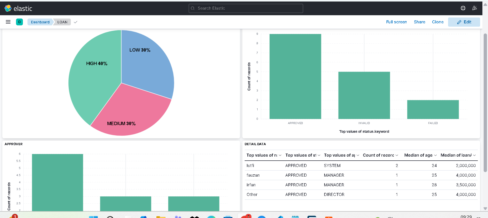

# Workflow System

Business process & workflow system using Camunda, FastAPI, Neo4j, Elasticsearch, and Grafana for task management and monitoring.

## Deskripsi
Project ini merupakan implementasi sistem workflow end-to-end berbasis business process untuk mengelola dan memproses data task secara terstruktur dan terintegrasi.

## Tujuan
- Meningkatkan efisiensi dan otomatisasi proses bisnis
- Mendukung monitoring sistem secara real-time
- Mempermudah pengelolaan dan analisis data berbasis workflow

## Arsitektur Sistem

## Business Process

## Monitoring (Grafana)

## Data Indexing (Elasticsearch)

## Teknologi yang Digunakan
- Camunda (Workflow Engine)
- FastAPI (Backend API)
- Neo4j (Graph Database)
- Elasticsearch (Data Indexing & Search)
- Grafana (Monitoring & Visualization)

## Alur Sistem
Camunda → Worker → FastAPI → Neo4j → Elasticsearch → Grafana

## Fitur Utama
- Workflow otomatis berbasis business process (BPMN)
- Integrasi API untuk pengelolaan data task
- Monitoring sistem dan visualisasi performa secara real-time
- Penyimpanan data relasional berbasis graph (Neo4j)

## Hasil
- Implementasi sistem workflow terintegrasi end-to-end
- Peningkatan efisiensi proses task berbasis automation
- Monitoring dan analisis sistem menjadi lebih terstruktur dan real-time
